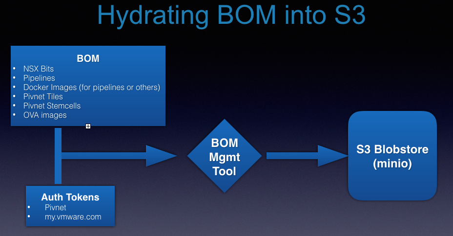
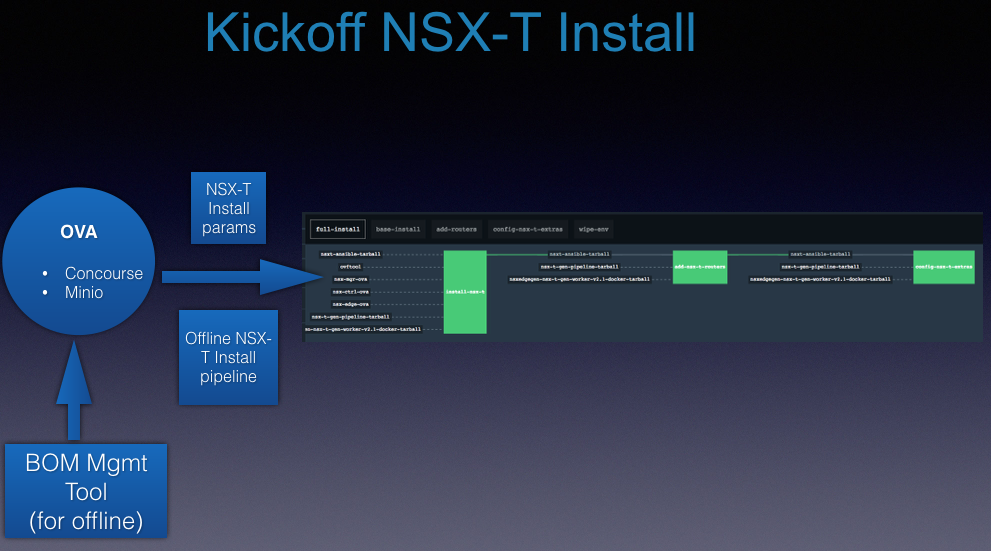
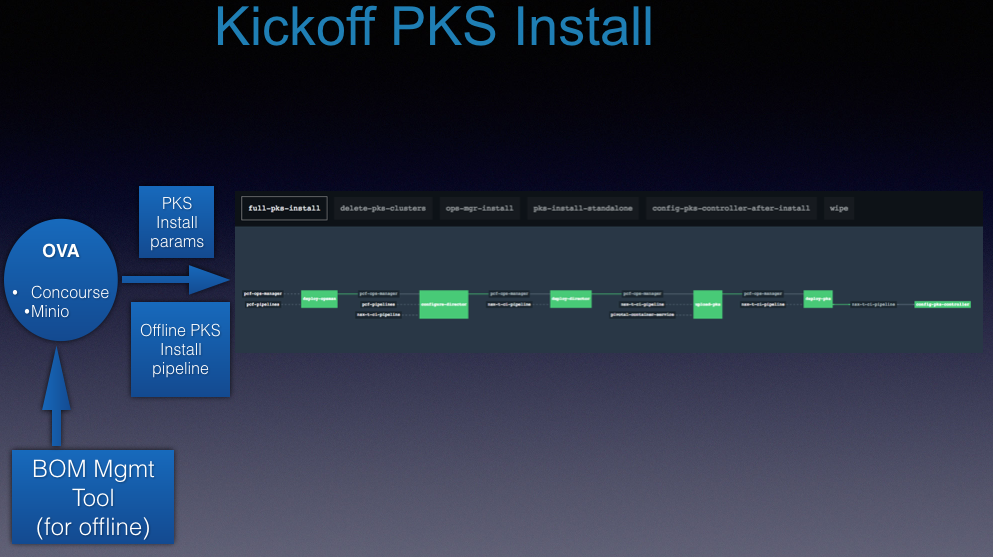
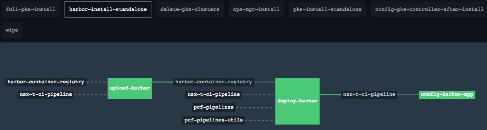

# canned-pks
Complete automated install of NSX-T and PKS in a can.

The install is meant to be run in an offline mode by first creating an OVA that can be used to run [Concourse](https://concourse-ci.org) and [Minio](https://github.com/minio/) while all the necessary bits that are required (either by the pipeline or the install) gets persisted into a S3 Blobstore (minio) and then used by the pipeline during the install to complete NSX-T and PKS deployments.

## Associated Repos
* [Boostrap OVA]()
* [NSX-T v2.1 Install pipeline Repo](https://github.com/sparameswaran/nsx-t-gen/tree/nsxt-2.1)
* [NSX-T v2.1 Ansible scripts Repo](https://github.com/sparameswaran/nsxt-ansible/tree/nsxt-2.1)
* [PKS v1.1.* Install pipeline Repo](https://github.com/sparameswaran/nsx-t-ci-pipeline/tree/nsxt-2.1)
* [BOM-Mgmt Repo](https://github.com/pivotalservices/bom-mgmt)

## Kickoff OVA

OVA image that contains the Concourse and minio pre-installed to run the offline installs.

## Bill of Materials (BOM)

Bill of Materials are comprised of online sources that need to be downloaded and then uploaded into S3 blobstore (minio) to install NSX-T and PKS in offline mode. Includes:

* Github repo tarballs
* Docker images used by pipelines
* Ova images (for NSX-T, Ops Mgr)
* Tiles (PKS, Harbor including their supported stemcells)
* Other binaries (ovftool)

<div></div>
The steps involved in download from online and upload to offline store is discussed after the client machine setup.

## Client Machine Setup
The Jumpbox or client vm where the BOM is downloaded and uploaded needs access to online resources and also should have Docker and other utilities installed.

Additionally, the OVA needs to be up with minio running on it before proceeding with connecting to it and uploading bits.

* Docker: BOM-mgmt tool requires docker cli for downloading and saving the images as Tar-balls. Steps for [installing docker here](docs/install-docker.md).

  Once docker has been installed, add the current user as part of docker group and see if it can run a test docker image.
  ```
  ## Replace <USER> with user id
  sudo usermod -a -G docker <USER>
  sudo docker run hello-world
  ```
* minio client (mc): minio client tool to initialize minio bucket and validate the upload. Installing minio client:
  ```
  wget https://dl.minio.io/client/mc/release/linux-amd64/mc
  chmod +x mc
  ```
  Connect to the minio blobstore
  ```
  mc config host add bomstore http://<MINIO_HOST>:<MINIO_PORT> <minio_access_id> <minio_secret_access_key>
  ```
  Create the `canned-pks` bucket
  ```
  # Create the bucket ‘canned-pks’ either using browser access or using command line
  mc mb bomstore/canned-pks

  ```
* bom-mgmt tool: utility to download and upload Bill of Materials (BOM) into Minio Blobstore. The tool can be downloaded from https://github.com/pivotalservices/bom-mgmt/releases

* python: To run the [`param-merger`](./tools/param-merger) merger tool for merging user filled params with rest of the install parameters.

* fly: To register and kickoff pipelines against Concourse
Download latest linux binary version from [here](https://github.com/concourse/concourse/releases/download/v4.0.0/fly_linux_amd64)

Note: A [script](./tools/download-tools.sh) is provided to download bom-mgmt, mc and fly versions into a current working directory. Please edit the version of BOM tool to pull down the latest version:

## Download and Upload of BOM Bits into S3

* Downloading BOM bits

Verify the contents of [bom file](./bom/bom-for-canned-nsx-t-pks-harbor-install-v2.1.yml) are valid (like pointing to correct repos, docker images, pivnet or vmware tokens etc.) before starting the download.
Also, ensure the pre-reqs specified (installing docker, minio client and bom-mgmt tool) have been satisfied and the tools is being run in an environment with online access.

```
export MINIO_HOST="<MINIO_HOST>:<MINIO_PORT>"
export MINIO_ACCESS_KEY="<minio_access_id>"
export MINIO_SECRET="<minio_secret_access_key>"

# Sample: /home/ubuntu/test-bits is a folder to save the downloaded bits
./bom-mgmt download-bits --bits "/home/ubuntu/test-bits" --bom <bom_yml_file>
```
  Download script file available under [tools](./tools/bom-downloader.sh).

* Uploading BOM bits

Upload the BOM bits into the minio s3 blobstore:
```
export MINIO_HOST="<MINIO_HOST>:<MINIO_PORT>"
export MINIO_ACCESS_KEY="<minio_access_id>"
export MINIO_SECRET="<minio_secret_access_key>"

# Sample: /home/ubuntu/test-bits as the folder to refer to the downloaded bits
# Replace 'canned-pks' with different minio bucket name as needed
./bom-mgmt upload-bits --bits "/home/ubuntu/test-bits" --bom <bom_yml_file> --bucket "canned-pks"
```
  Upload script file available under [tools](./tools/bom-uploader.sh).

## Pipeline Templates

The pipeline templates for installing the NSX-T v2.1 and PKS v1.1.1

* [offline-nsx-t-install-pipeline](./pipelines/offline-nsx-t-install-v2.1.yml)
Pipeline to run things in offline mode where all the dependent artifacts and resources are available on the S3 Blobstore (github repos, docker images, ova, other binaries etc.) for install of NSX-T v2.1

* [offline-install-pks-pipeline](./pipelines/offline-install-pks-pipeline-v2.1.yml)
Pipeline to run things in offline mode where all the dependent artifacts and resources are available on the S3 Blobstore (github repos, docker images, tiles, stemcells, ova, other binaries etc.) for install of PKS v1.1.1

## Params
Parameters that need to be filled by the user and merged with other pre-filled  parameters for installing NSX or PKS.

* [user-inputs-for-canned-pks.yml](./params/user-inputs-for-canned-pks.yml)
User will fill in the parameters relating to the vSphere connectivity, network configs, NSX-T desired topology and creds along with other data around final end configurations for NSX or PKS (like domain names, pks cli user creds etc.)

The minio offline bucket params should be updated to point to the correct minio bucket hosting the saved BOM bits:
```
# Minio offline bucket params
iaas: vsphere
final_s3_endpoint: http://<MINIO_HOST>:<MINIO_PORT>/
final_s3_bucket: canned-pks
final_s3_access_key_id: <minio_access_id>
final_s3_secret_access_key: <minio_secret_access_key>
offline_run_id: “”
```

* [nsx-t-for-canned-pks-params.yml](./params/nsx-t-for-canned-pks-params.yml)
Pre-filled parameters for NSX-T install that would be merged with user provided parameters to build the effective parameters for the NSX-T install.

* [params-for-canned-pks.yml](./params/params-for-canned-pks.yml)
Pre-filled parameters for PKS Tile install that would be merged with user provided parameters to build the effective parameters for the PKS install.

* [params-for-canned-pks-harbor.yml](./params/params-for-canned-pks-harbor.yml)
Pre-filled parameters for Harbor Tile install that would be merged with user provided parameters to build the effective parameters for the Harbor install.

### Merging the params
The effective parameters should be generated using the `param-merger` tool (available under tools folder) to merge the user filled parameters with rest of pre-filled parameters. Ensure `python` is installed on the machine to run the param-merger tool.

<div></div>

* For generating the effective params for NSX-T Install for use with the offline nsx-t install pipeline:
```
# nsx-t-for-canned-pks-params.yml has pre-filled parameters for fixed config, with some parameterized elements that need to be filled by user
# user-inputs-for-canned-pks is the params file that has the actual user filled values
./param-merger <nsx-t-for-canned-pks-params.yml> <user-inputs-for-canned-pks.yml> effective-nsx-t-install-params.yml
```
* For generating the effective params for PKS Tile Install for use with its offline pipeline:
```
# params-for-canned-pks.yml has pre-filled parameters for fixed config, with some parameterized elements that need to be filled by user
# user-inputs-for-canned-pks is the params file that has the actual user filled values
./param-merger <params-for-canned-pks.yml> <user-inputs-for-canned-pks.yml> effective-pks-install-params.yml
```
* For generating the effective params for Harbor Tile Install for use with the offline pipeline:
```
./param-merger <params-for-canned-pks-harbor.yml> <user-inputs-for-canned-pks.yml> effective-harbor-install-params.yml
```

## Running the install
Note: Ensure the jumpbox or client machine from where concourse gets kicked off to have access to the concourse server and has `fly` installed and also has the pipeline templates and effective parameters file ready and available.

* Login into Concourse and sync fly to correct version
```
fly -t concourse-canned-pks login -k --concourse-url <http://concourse-url-endpoint>
fly -t concourse-canned-pks sync
```
* Installing NSX-T
Register the generated effective param file with the offline NSX-T install pipeline template to kick off the NSX-T install in offline mode:

```
fly -t concourse-canned-pks sp -p offline-install-nsx-t -c pipelines/offline-nsx-t-install-v2.1.yml -l effective-nsx-t-install-params.yml
fly -t concourse-canned-pks unpause-pipeline -p  offline-install-nsx-t
```
  Go to the `full-install` Job tab and hit `+` icon against `install-nsx-t` to kick off the install

  Note: Ensure no errors or missing parameters are reported during the registration of the pipeline.

  <div></div>

* Installing PKS
Register the generated effective PKS & Harbor param file with the offline PKS install pipeline template to kick off the PKS install in offline mode:

```
fly -t concourse-canned-pks sp -p offline-install-pks \
    -c pipelines/offline-install-pks-pipeline-v2.1.yml \
    -l effective-nsx-t-install-params.yml  \
    -l effective-harbor-install-params.yml

fly -t concourse-canned-pks unpause-pipeline -p  offline-install-pks
```
  Go to the `full-pks-install` Job group tab and hit `+` icon against `deploy-opsman` install to kick off the install

  Note: Ensure no errors or missing parameters are reported during the registration of the pipeline.

  <div></div>

* Installing Harbor
Select the `harbor-install-standalone` tab at top and hit `+` icon against upload-harbor to kick off the Harbor Tile install in offline mode.

  <div></div>
