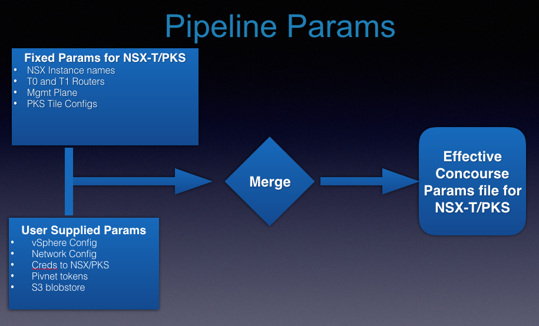

# canned-pks
Complete automated install of NSX-T and PKS in a can.

# DISCLAIMER

This pipeline is not supported or maintained going forward as of Oct 17th, 2018. All development work has now stopped.

Kindly use the official [Pivotal PCF Pipelines](https://github.com/pivotal-cf/pcf-pipelines) and the [PCF Automation toolkit] (https://network.pivotal.io/products/pcf-automation) for official install pipelines/toolkits. 

# Details
The install is meant to be run in an offline mode by first creating an OVA that can be used to run [Concourse](https://concourse-ci.org) and [Minio](https://github.com/minio/) while all the necessary bits that are required (either by the pipeline or the install) gets persisted into a S3 Blobstore (minio) and then used by the pipeline during the install to complete NSX-T and PKS deployments.
<div></div>

The install takes an opinionated view, it only supports single compute cluster (hosts from that cluster would be used to run/manage the PKS VMs and clusters), not multiple compute clusters. This compute cluster can be same or different from the NSX-T management plane cluster.

## Associated Repos
* Boostrap OVA or an VM image that has concourse and minio running
* [NSX-T v2.1 Install pipeline Repo](https://github.com/sparameswaran/nsx-t-gen/tree/nsxt-2.1)
* [NSX-T v2.2 Install pipeline Repo](https://github.com/sparameswaran/nsx-t-gen/tree/nsxt-2.2)
* [NSX-T v2.3 Install pipeline Repo](https://github.com/sparameswaran/nsx-t-gen/tree/nsxt-2.3)
* [NSX-T Ansible scripts (handle both v2.1, 2.2 and 2.3) Repo](https://github.com/sparameswaran/nsxt-ansible/tree/nsxt-2.1)
* [PKS v1.* Install pipeline Repo](https://github.com/sparameswaran/nsx-t-ci-pipeline/tree/nsxt-2.1)
* [BOM-Mgmt Repo](https://github.com/pivotalservices/bom-mgmt)

## High Level steps
* Deploy the prebuilt OVA image containing Concourse and Minio on vCenter. The credentials to the concourse and minio are hardcoded into the built image.
Or it can be BYO (build or bring your own) concourse and minio server instances.
* Ensure the minio server is accessible from the jumpbox VM.
* Use a Jumpbox or client machine (with internet access and connection to the Concourse VM) to run next set of steps with the canned-pks repo contents:
  * Edit the `tools/setup.sh` as needed to specify the minio endpoint/credentials as well as toggling the bom file name to preferred between version of NSX-T 2.1, 2.2 or 2.3.
  * Edit the `bom/bom-for-canned-pks*` file as needed to specify the vmware and Pivnet credentials
  * Start the download of relevant bits using the `tools/bom-downloader.sh` script. This would use the `bom/bom-for-canned-pks*` file as input and save it to a local folder.
  * Start the upload of the saved bits into minio using the `tools/bom-uploader.sh` script.
  * Now the bits are all saved in the Minio blobstore.
* Now there is no more need for internet connection.
* Next step is to edit the parameters for install/deploy of NSX-T and layered products.
  * Edit the `params/user-inputs-for-canned-pks.yml` file .
  * Then run the `tools/param-merger` to merge the pre-filled `params/nsx-t-for-canned-pks-params.yml` with the `params/user-inputs-for-canned-pks.yml` to get an effective param file for nsx-t install.
  * Same way, generate the effective param file for PKS install.
* Next is to register the pipeline and params against Concourse
  * Install NSX-T
  * Install PKS

Check for more details on the following sections and also the [FAQ](docs/faqs.md) section.

## Kickoff OVA

OVA image that contains the Concourse and minio pre-installed to run the offline installs. Or if you have your own Concourse and Minio instances, use it.

## Bill of Materials (BOM)

Installing the NSX-T or PKS requires access to couple of resources that are available in online mode and not in offline mode; these include github repos, docker images used by concourse tasks, Pivotal Tiles available from Pivnet, Stemcells, OVA images (either for Pivotal Ops Manager, or NSX-T, other file resources etc.). These dependent artifacts together form the Bill of Materials (BOM).

The Bill of Materials need to be downloaded in online mode and then uploaded into S3 blobstore (minio) for the install pipelines of NSX-T and PKS to function in offline mode. BOM would include:

* Github repo tarballs
* Docker images used by pipelines
* Ova images (for NSX-T, Ops Mgr)
* Tiles (PKS, Harbor including their supported stemcells)
* Other binaries (ovftool)

<div></div>
The steps involved in download from online and upload to offline store is discussed after the client machine setup.

## Structure of BOM

The bom file (under bom folder) specifies the Bill of Materials required for execution of the Concourse pipeline in an offline mode including the github repos, nsx or other install bits, Pivnet Tiles + stemcells, docker images used by the pipeline etc.

Also, the tokens required to interact with my.vmware.com or network.pivotal (pivnet) to download bits are specified in the bom file.

The `tools/setup.sh` contains the creds to connect to the Minio S3 Blobstore and also the bucket to be used to store the offline resources. Based on the resource type specified in BOM file, the resource would be saved and uploaded into the specific paths in the offline bucket by the `bom-mgmt` tool.
It also specifies the bom file to use. Select a different version of the bom file if interested in NSX-T v2.2 or 2.3.


| Resource Type |resourceType value | Additional fields | Content Type | Path saved under Blobstore | Notes |
| ------------- |------------------ | ----------------- | -------------| ---------------------------| ----- |
| `Github` | `git` | name, branch, gitRepo | `application/gzip`| `offline-bucket`/resources/git/<name-of-resource> | tgz of root of the github |        
| `Docker` | `docker` | name, imageName | `application/gzip`| `offline-bucket`/resources/docker/<name-of-resource> | tgz of exported docker image with some additions[1] |
| `Pivnet Tile` | `productSlug` | name, version, globs | `application/gzip`| `offline-bucket`/resources/pivnet-tile/<name-of-resource> |tgz of the Tile + associated stemcell   |
| `Pivnet Ops Mgr Ova` | `productSlug` | name, version, globs | `application/gzip`| `offline-bucket`/resources/pivnet-non-tile/<name-of-resource> |Just ova file   |
| `VMware bit` | `vmware` | name, productSlug | `application/vmware`| `offline-bucket`/resources/vmware/<name-of-resource> | Downloadable bit from my.vmware.com[2] |


[1]: The exported docker image should have a metadata.json file at root (same level as rootfs folder) containing following content (added by bom-mgmt tool automatically):
```
{ "user": "root", "env": [ "PATH=/usr/local/sbin:/usr/local/bin:/usr/sbin:/usr/bin:/sbin:/bin", "LANG=C", "HOME=/root" ] }
```
[2]: To manually download vmware bits (requires login)
[NSX-T 2.1 bits](https://my.vmware.com/group/vmware/details?downloadGroup=NSX-T-210&productId=673)
[NSX-T 2.2 bits](https://my.vmware.com/group/vmware/details?downloadGroup=NSX-T-220&productId=673)
[NSX-T 2.3 bits](https://my.vmware.com/group/vmware/details?downloadGroup=NSX-T-230&productId=673)
[OVFTool 4.2 bits](https://my.vmware.com/group/vmware/details?productId=614&downloadGroup=OVFTOOL420#)

### Sample Step for a given entry in bom file:
All the steps described below are handled automatically by the `bom-downloader.sh` and `bom-uploader.sh` scripts using the `bom-mgmt` tool.
* For github resource, download the copy of the code from github (using the correct branch specified), ensure there are no temporary folders, all code starts with root of the repo, all submodules are complete and create a tarball with the name specified and save it into the offline bucket under resources/git folder with same name as specified. These are done automatically by the bom-mgmt tool.
```
- name: nsx-t-gen-pipeline-tarball.tgz
  contentType: application/gzip
  resourceType: git
  branch: nsxt-2.1
  gitRepo: https://github.com/sparameswaran/nsx-t-gen
```
Change the branch to nsxt-2.2 for installing NSX-T v2.2
Change the branch to nsxt-2.3 for installing NSX-T v2.3

* For Docker image, use docker to download the bits from docker hub, run it and export the bits as a tarball. Then add the additional metadata.json file with content specified earlier and add it to the root of the tarball image. Save the final tarball into the offline bucket under resources/docker folder with same name as specified in bom file.
```
- name: nsxedgegen-nsx-t-gen-worker-v2.1-docker.tgz
  contentType: application/gzip
  resourceType: docker
  imageName: nsxedgegen/nsx-t-gen-worker
```
Change the version to v2.2(3) for installing NSX-T v2.2(3)

* For Pivnet tiles, create a tarball of the tile + stemcell specified (that matches the stemcell version specified in the tile metadata and iaas) and save it under the resources/pivnet-tile folder of the offline bucket.
* For Pivnet non-Tiles (like Ops Mgr Ova), download the OVA version specified in the bom (and matching the IAAS) and save it under the resources/pivnet-non-tile folder of the offline bucket.
* For VMware bits (like NSX-T or Ovftool), download the bits with version specified in the bom (and matching the type) and save it under the resources/vwmare folder of the offline bucket.

## FAQs

Check the detailed [FAQs](docs/faqs.md) doc to check on pre-reqs and other issues before proceeding with the install.

## Client Machine Setup
The Jumpbox or client vm where the BOM is downloaded and uploaded needs access to online resources and also should have Docker and other utilities installed.

Additionally, the OVA needs to be up with minio running on it before proceeding with connecting to it and uploading bits.

* Docker: BOM-mgmt tool requires docker cli for downloading and saving the images as Tar-balls. Steps for [installing docker here](docs/install-docker.md).

  Once docker has been installed, add the current user as part of docker group and see if it can run a test docker image.
  ```
  ## Replace <USER> with user id
  sudo usermod -a -G docker <USER>
  sudo docker run hello-world
  ```
* minio client (mc): minio client tool to initialize minio bucket and validate the upload. Installing minio client:
  ```
  wget https://dl.minio.io/client/mc/release/linux-amd64/mc
  chmod +x mc
  ```
  Connect to the minio blobstore
  ```
  mc config host add bomstore http://<MINIO_HOST>:<MINIO_PORT> <minio_access_id> <minio_secret_access_key>
  ```
  Create the `canned-pks` bucket
  ```
  # Create the bucket ‘canned-pks’ either using browser access or using command line
  mc mb bomstore/canned-pks

  ```
* `bom-mgmt` tool: utility to download and upload Bill of Materials (BOM) into Minio Blobstore. The tool can be downloaded from https://github.com/pivotalservices/bom-mgmt/releases

* python: To run the [`param-merger`](./tools/param-merger) merger tool for merging user filled params with rest of the install parameters.

* fly: To register and kickoff pipelines against Concourse
Download latest linux binary version from [here](https://github.com/concourse/concourse/releases/download/v4.0.0/fly_linux_amd64)

* unzip: to peek into the Pivotal Tiles and identify the stemcell version used by the tile.


Note: A [script](./tools/download-tools.sh) is provided to download bom-mgmt, mc and fly versions into a `tools` directory and check other pre-reqs. Change to the `tools` folder. Edit the `setup.sh` script (and select which version of NSX-T to install by toggling the bom file) and then run the
`download-tools.sh` from within the `tools` directory.

## Download and Upload of BOM Bits into S3

* Downloading BOM bits

Ensure the pre-reqs specified (installing docker, minio client and bom-mgmt tool) have been satisfied by running the `tools/setup.sh` and the tools is being run in an environment with online access. Please select the corresponding bom file version based version of NSX-T (v2.1, 2.2 or 2.3).

The bom file is specified/referred in the `tools/setup.sh` file. Check the correct matching version of the bom file based on version of NSX-T install desired. Then verify the contents of [bom for v2.1](./bom/bom-for-canned-nsx-t-pks-harbor-install-v2.1.yml) or [bom for v2.2](./bom/bom-for-canned-nsx-t-pks-harbor-install-v2.2.yml) or [bom for v2.3](./bom/bom-for-canned-nsx-t-pks-harbor-install-v2.3.yml) are valid (like pointing to correct repos, docker images, pivnet or vmware tokens etc.) before starting the download.

Change to the `tools` folder. Edit the `setup.sh` script and then run the `bom-downloader.sh`. This would start the download of the various github, docker hub and pivotal resources declared in the bom file followed by downloading of my.vmware.com resources using a special docker image.

* Uploading BOM bits

Upload the BOM bits into the minio s3 blobstore by change to the `tools` folder, edit the `setup.sh` script and then run the `bom-uploader.sh`.

## Pipeline Templates

The pipeline templates for installing the NSX-T v2.x and PKS v1.1.1

* [offline-nsx-t-install-pipeline for v2.1](./pipelines/offline-nsx-t-install-v2.1.yml)
Pipeline to run things in offline mode where all the dependent artifacts and resources are available on the S3 Blobstore (github repos, docker images, ova, other binaries etc.) for install of NSX-T v2.1

* [offline-nsx-t-install-pipeline for v2.2](./pipelines/offline-nsx-t-install-v2.2.yml)
Pipeline to run things in offline mode where all the dependent artifacts and resources are available on the S3 Blobstore (github repos, docker images, ova, other binaries etc.) for install of NSX-T v2.2

* [offline-nsx-t-install-pipeline for v2.3](./pipelines/offline-nsx-t-install-v2.3.yml)
Pipeline to run things in offline mode where all the dependent artifacts and resources are available on the S3 Blobstore (github repos, docker images, ova, other binaries etc.) for install of NSX-T v2.3

* [offline-install-pks-pipeline](./pipelines/offline-install-pks-pipeline.yml)
Pipeline to run things in offline mode where all the dependent artifacts and resources are available on the S3 Blobstore (github repos, docker images, tiles, stemcells, ova, other binaries etc.) for install of PKS v1.x

## Params
Parameters that need to be filled by the user and merged with other pre-filled  parameters for installing NSX or PKS.

* [user-inputs-for-canned-pks.yml](./params/user-inputs-for-canned-pks.yml)
User will fill in the parameters relating to the vSphere connectivity, network configs, NSX-T desired topology and creds along with other data around final end configurations for NSX or PKS (like domain names, pks cli user creds etc.)

The minio offline bucket params should be updated to point to the correct minio bucket hosting the saved BOM bits:
```
# Minio offline bucket params
iaas: vsphere
final_s3_endpoint: http://<MINIO_HOST>:<MINIO_PORT>/
final_s3_bucket: canned-pks
final_s3_access_key_id: <minio_access_id>
final_s3_secret_access_key: <minio_secret_access_key>
offline_run_id: “”
```

* [nsx-t-for-canned-pks-params.yml](./params/nsx-t-for-canned-pks-params.yml)
Pre-filled parameters for NSX-T install that would be merged with user provided parameters to build the effective parameters for the NSX-T install.

* [params-for-canned-pks.yml](./params/params-for-canned-pks.yml)
Pre-filled parameters for PKS Tile install that would be merged with user provided parameters to build the effective parameters for the PKS install.

* [params-for-canned-pks-harbor.yml](./params/params-for-canned-pks-harbor.yml)
Pre-filled parameters for Harbor Tile install that would be merged with user provided parameters to build the effective parameters for the Harbor install.

### Merging the params
The effective parameters should be generated using the `param-merger` tool (available under tools folder) to merge the user filled parameters with rest of pre-filled parameters. Ensure `python` is installed on the machine to run the param-merger tool.

<div></div>

* For generating the effective params for NSX-T Install for use with the offline nsx-t install pipeline:
```
# nsx-t-for-canned-pks-params.yml has pre-filled parameters for fixed config, with some parameterized elements that need to be filled by user
# user-inputs-for-canned-pks is the params file that has the actual user filled values
./param-merger <nsx-t-for-canned-pks-params.yml> <user-inputs-for-canned-pks.yml> effective-nsx-t-install-params.yml
```
* For generating the effective params for PKS Tile Install for use with its offline pipeline:
```
# params-for-canned-pks.yml has pre-filled parameters for fixed config, with some parameterized elements that need to be filled by user
# user-inputs-for-canned-pks is the params file that has the actual user filled values
./param-merger <params-for-canned-pks.yml> <user-inputs-for-canned-pks.yml> effective-pks-install-params.yml
```
* For generating the effective params for Harbor Tile Install for use with the offline pipeline:
```
./param-merger <params-for-canned-pks-harbor.yml> <user-inputs-for-canned-pks.yml> effective-harbor-install-params.yml
```
## Other Changes before kicking off Install

Check the full [FAQS](docs/faqs.md) section for the DNS changes required to handle routing to Ops Mgr, NSX Mgr, PKS Controller and Harbor.

## Running the install
Note: Ensure the jumpbox or client machine from where concourse gets kicked off to have access to the concourse server and has `fly` installed and also has the pipeline templates and effective parameters file ready and available.

* Login into Concourse and sync fly to correct version
```
fly -t concourse-canned-pks login -k --concourse-url <http://concourse-url-endpoint>
fly -t concourse-canned-pks sync
```
* Installing NSX-T
Register the generated effective param file with the offline NSX-T install pipeline template to kick off the NSX-T install in offline mode:

```
fly -t concourse-canned-pks sp -p offline-install-nsx-t -c pipelines/offline-nsx-t-install-v2.1.yml -l effective-nsx-t-install-params.yml
fly -t concourse-canned-pks unpause-pipeline -p  offline-install-nsx-t
```
  Go to the `full-install` Job tab and hit `+` icon against `install-nsx-t` to kick off the install

  Note: Ensure no errors or missing parameters are reported during the registration of the pipeline.

  <div></div>


  Ensure the dns records are present for NSX Mgr FQDN and pointing to correct values.

Note: In case of any issues or request to delete the install, use the wipe-env job to wipe away the NSX-T Mgmt plane and also to remove the NSX-T vibs from the ESXi hosts. The wipe does require a manual rolling restart of the ESXi hosts for clean removal of the vibs at end of the wipe job.


* Installing PKS
Register the generated effective PKS & Harbor param file with the offline PKS install pipeline template to kick off the PKS install in offline mode:

```
fly -t concourse-canned-pks sp -p offline-install-pks \
    -c pipelines/offline-install-pks-pipeline-v2.1.yml \
    -l effective-nsx-t-install-params.yml  \
    -l effective-harbor-install-params.yml

fly -t concourse-canned-pks unpause-pipeline -p  offline-install-pks
```
  Go to the `full-pks-install` Job group tab and hit `+` icon against `deploy-opsman` install to kick off the install

  Note: Ensure no errors or missing parameters are reported during the registration of the pipeline.

  <div></div>

  Users can opt to go with single or three azs. Ensure the resource pools are created, along with dns records for PKS controller.

* Installing Harbor
Select the `harbor-install-standalone` tab at top and hit `+` icon against upload-harbor to kick off the Harbor Tile install in offline mode.

  <div></div>

Ensure the dns records are present for harbor.<domain>.
